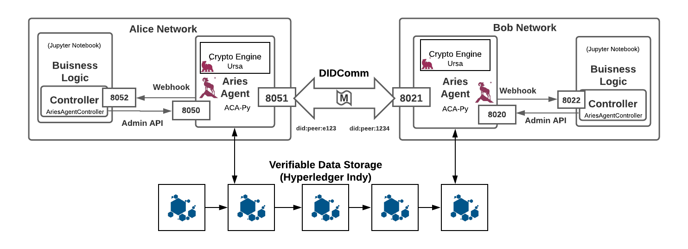

# Aries ACA-Py Jupyter Playground

## A Jupyter Notebook Based Playground for Education and Experimentation with Hyperledger Aries

## Requirements

This project is written in Python and is displayed in jupyter notebooks.

You need to install:
1. [Docker](https://docs.docker.com/get-docker/)
2. [docker-compose](https://docs.docker.com/compose/install/)
3. The **source-to-image** (s2i) tool is also required to build the docker images used in the demo. S2I can be downloaded [here](https://github.com/openshift/source-to-image). The website gives instructions for installing on other platforms like MACOS, Linux, Windows.
Verify that **s2i** is in your PATH.  If not, then edit your PATH and add the directory where **s2i** is installed.  The **manage** script will look for the **s2i** executable on your PATH.  If it is not found you will get a message asking you to download and set it on your PATH.
    - If you are using a Mac and have Homebrew installed, the following command will install s2i: `brew install source-to-image`
    - If you are using Linux, go to the [releases](https://github.com/openshift/source-to-image/releases/latest) page and download the correct distribution for your machine. Choose either the linux-386 or the linux-amd64 links for 32 and 64-bit, respectively. Unpack the downloaded tar with `tar -xvf "Release.tar.gz"`
    - If you are not sure about your Operating System you can visit [this](https://whatsmyos.com/) and/or follow the instructions.
    - You should now see an executable called s2i. Either add the location of s2i to your PATH environment variable, or move it to a pre-existing directory in your PATH. For example, `sudo cp /path/to/s2i /usr/local/bin` will work with most setups. You can test it using `s2i version`.

Ensure that Docker is running. If it is not try `sudo dockerd` in another terminal.

## Starting the Playground

This playground comes with example configuration of two actors Alice and Bob.

Before you can launch the playground you must set the .env file for each of Alice and Bob. The file should be under `playground/<agent_name>/.env`. 

For quick start just copy the example env files provided (e.g. bob-example.env) and rename them to .env.

Then run:

`./manage.sh start`

This spins up all docker containers defined in the `docker-compose.yml` file and named in the DEFAULT_CONTAINERS variable defined in the `manage.sh` shell script.

The urls for the jupyter notebook server for each agent can be retrieved by running `./scripts/get_URLS.sh` in a terminal from the root of this project.

To stop the playground either:

`./manage.sh stop` - this terminates the containers but persists the volumes. Specifically the agent wallet storage held in postgres-db's

`./manage.sh down` - terminate containers and delete all volumes

## Writing Business Logic

The aim of this respository is to simplify the process by which you can spin up a set of actors specific to a domain and start to experiment with relevant information exchanges using the Hyperledger verifiable information exchange platform.

All business logic is written is python through jupyter notebooks. Alongside this repository we have developed a pip installable package the [Aries Cloud Controller](https://github.com/didx-xyz/aries-cloudcontroller-python), which provides an easy to use interface to interact with the Swagger API exposed by ACA-Py agents as well as receive and handle webhook events they post.

To streamline the process of writing business logic further, each business-logic docker service has the `recipes` folder mounted such that it is accessible through the jupyter interface. In here there are a set of templates for common protocols you might want your agents to engage in. We suggest you copy these templates into the root of the notebook server and customise from there.

If you wish to learn more about applying SSI, the Hyperledger Stack and the Aries Cloud Controller within this setting a set of tutorials have been developed within a similar notebook-playground environment in the [OpenMined PyDentity](https://github.com/OpenMined/PyDentity) repo. This code is a generalisation of a pattern we repeated regularly while building this code.

## Configuring the Playground

The playground is designed to make it easy for you to add new actors and start writing SSI ecosystem flows. 

To add an actor you need to make three changes:

* Create a folder under `playground` for that actor and make sure it has a .env file under that folder. You can copy the template `actor` folder and use the `dummy.env` file to get started but will need to edit the file.
* Define the actor services in the `docker-compose.yml`. More detailed instructions included in the comments in that file, including commented out set of services for the actor `actor` that you can copy and use as a template to get started. You will need to edit these.
* Add the new services to the DEFAULT_CONTAINERS variable in the `manage.sh` script

Feel free to customise Alice and Bob aswell. It makes sense to name your actors something meaningful to the usecase you are trying to model.

## ACA-Py Agent Configuration

Each agent instance has it's own environment file e.g. `alice/.alice-example.env`. These define default ACA-PY environment variables, which are best understood by reading through the code that parses them. This can be found [here](https://github.com/hyperledger/aries-cloudagent-python/blob/main/aries_cloudagent/config/argparse.py).

## Using Different Indy Networks

An aries agent points to the indy network it wishes to use to write and resolve cryptographic objects to and from. All actors in the flow should use the same network - See the ACA_PY_GENESIS_URL argument in .env files.

The master branch currently is set to use the Sovrin StagingNet.

It is also possible to use the BC Gov's Test Network VON - http://greenlight.bcovrin.vonx.io/genesis

Or a local ledger can be spun up either within the docker-compose.yml or separately by cloning the [VON codebase](https://github.com/bcgov/von-network)

